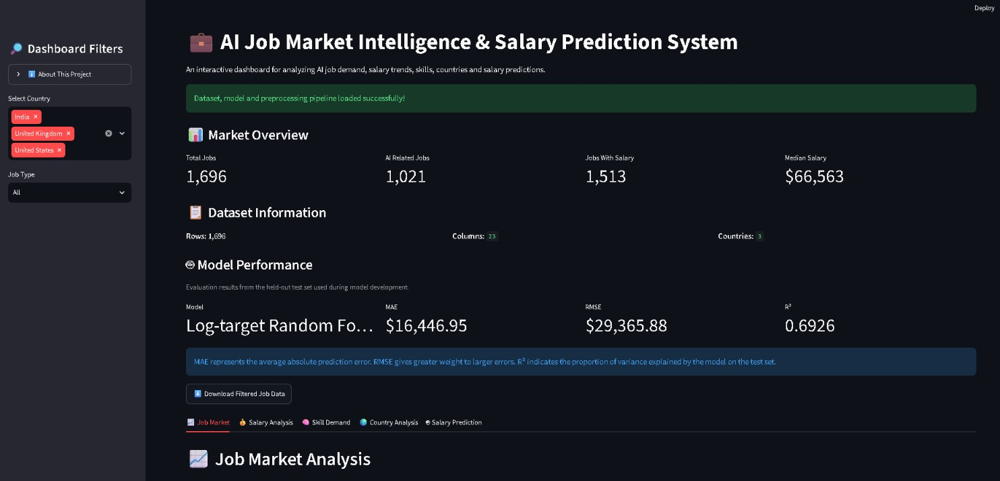

# 💼 AI Job Market Intelligence & Salary Prediction System

An end-to-end **Data Science and Machine Learning project** that analyzes AI job-market data to identify job demand, salary trends, in-demand skills, geographic patterns, and estimated salaries for different job profiles.

The project combines **Data Analysis, Data Visualization, Machine Learning, and an interactive Streamlit dashboard** into a single application.

---

## 📊 Dashboard Preview



---

## 🎯 Project Objectives

The main objectives of this project are:

- Analyze AI and non-AI job demand
- Identify the most common job roles and categories
- Analyze salary distributions across countries
- Standardize salaries into USD
- Identify in-demand technical skills
- Analyze geographic job-market patterns
- Study contract types and working arrangements
- Build a machine-learning model for salary prediction
- Develop an interactive Streamlit dashboard
- Provide downloadable filtered job-market data

---

## 📌 Dataset Overview

The dataset contains **1,696 job postings** collected from the AI job market.

| Metric | Value |
|---|---:|
| Total Job Postings | 1,696 |
| AI-Related Jobs | 1,021 |
| Jobs With Salary Information | 1,513 |
| Countries | 3 |
| Processed Columns | 23 |
| Salary Currencies | USD, GBP, INR |
| Date Range | 2019–2026 |

### Countries

The dataset contains job postings from:

- 🇺🇸 United States
- 🇬🇧 United Kingdom
- 🇮🇳 India

---

## 🧹 Data Cleaning & Preprocessing

The project includes several preprocessing steps:

- Loaded the raw CSV dataset using Pandas
- Checked dataset dimensions and data types
- Identified missing values
- Checked duplicate rows
- Checked duplicate job IDs
- Handled missing company names
- Handled missing contract information
- Created a salary-specific dataset
- Checked salary ranges
- Investigated unusually low and high salary values
- Converted date columns to datetime
- Created salary quality flags
- Standardized salaries into USD

### Salary Standardization

The dataset contains multiple currencies.

For analysis, salary values were converted into USD using reference exchange rates.

> The exchange rates used are reference rates and are not historical exchange rates for each individual job-posting date.

---

## 📈 Exploratory Data Analysis

The project analyzes:

### Job Market

- Total job postings
- AI vs non-AI jobs
- Job categories
- Job titles
- Countries
- Contract types
- Contract time

### Salary Analysis

- Salary distribution
- Median salary
- Average salary
- Salary by country
- Salary by AI-related status
- Salary by job category
- Salary outliers

### Skill Demand

The project searches job descriptions for technical skill keywords such as:

- Artificial Intelligence
- Machine Learning
- Data Science
- Python
- AWS
- Azure
- Deep Learning
- NLP
- PyTorch
- SQL
- TensorFlow
- GCP
- Docker
- Scikit-learn
- Pandas
- NumPy

---

## 🤖 Machine Learning — Salary Prediction

A **Random Forest Regression** model was developed to estimate job salaries.

### Features Used

The model uses:

- Job title
- Job category
- Contract type
- Contract time
- Country
- AI-related status
- Salary-predicted status

### Target

```text
salary_usd

## 🚀 Live Demo
## 🚀 Live Demo

### 🌐 Interactive Dashboard

[](https://ai-job-market-intelligence-zkbzzzt2ilpkyvrusmdb6k.streamlit.app/)

Explore the live **AI Job Market Intelligence & Salary Prediction System**:

👉 https://ai-job-market-intelligence-zkbzzzt2ilpkyvrusmdb6k.streamlit.app/